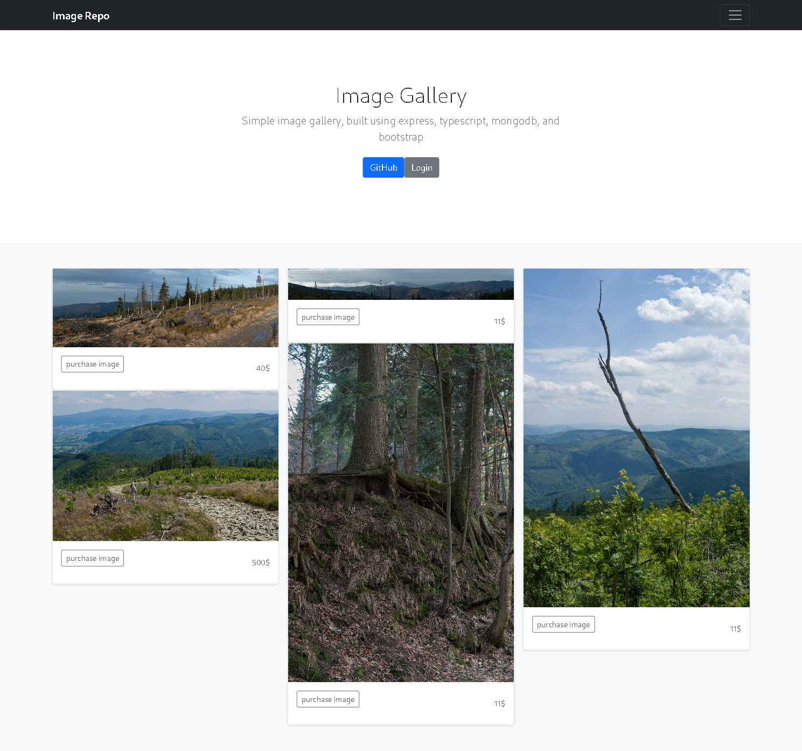

# Image Repository
Buy and sell images in this simple image repository demo.
This project uses typescript, mongodb, bootstrap, and express.js

## Getting Started
**You will need**:
- MongoDB
- npm
- Some images

### Download the source from GitHub and install dependencies
``` 
$ git clone https://github.com/winterNebs/img-repo.git 
$ cd img-repo
$ npm i
```
### Start MongoDB
```
mongod --dbpath /your/path/here
```
### Create .env file
img-repo uses a `.env` file in the root directory of the project with the following format:
```
PORT=8080
ROOT=img
DB=mongodb://127.0.0.1:27017/img
SECRET=Your_secret_here
```
Feel free to change any of the defaults as you need

### Add images
- Create your images folder. The one we will use is `/img` as defined in `.env` above.
- Put your images in there.

### For your first run
- Edit `index.ts` and uncomment the lines to populate the database
- Feel free to change the default usernames/passwords
- Make sure to change the images to reflect the images you provided

### Run the server
Build
```
$ npm run build
```
Start
```
$ npm run start
```
Build then Start
```
$ npm run bs
```
## Next Steps
If instead of a demo, this was supposed to be a real project, here are the next steps I would take:
- Routing in Models would go in separate files
- Register Page
    - Add form to index.pug 
    - Create register endpoint that creates a user and calls UserModels.register
- Other account related features
    - Rate limiting (ask me about ASC)
    - Reset tokens/email recovery (ASC)
    - A way to upload images
        - Create upload endpoint, similar to buy/sell, that also takes a file
- Use db session (ie connect-mongodb-session) instead of memory store
## Screenshots

.jpg)
.jpg)
